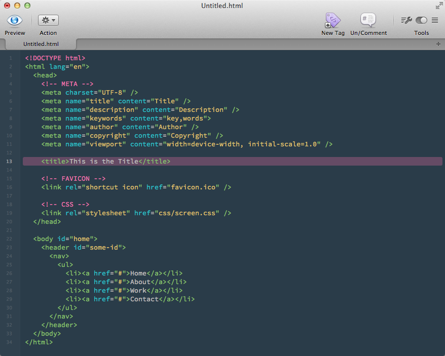

fuzzySpice
==========

fussySpice is an [Espresso](http://macrabbit.com/espresso/) theme based on [http://blogs.adobe.com/typblography/2012/09/source-code-pro.html](http://blogs.adobe.com/typblography/2012/09/source-code-pro.html)

How to Install
--------------

1. Navigate to Library > Application Support > Espresso > Themes and copy fussySpice.css
2. Restart Espresso
